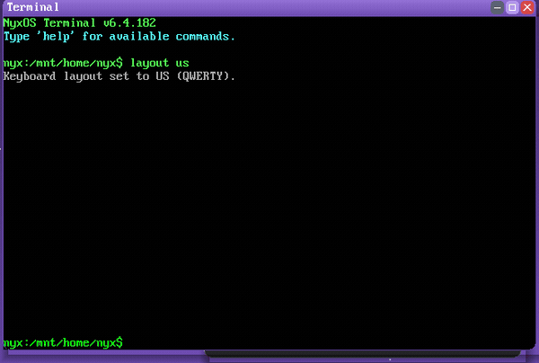

  

<strong>The terminal emulator of NyxOS — a windowed console over the <code>nyxsh</code> shell.</strong>

  
  &nbsp;
  
  &nbsp;
  
  &nbsp;
  

---

## About

**Erebus** — named for the primordial god of *darkness*, born of Nyx — is the terminal of NyxOS: a window that hosts the interactive shell. It renders a scrolling character grid, keeps a keystroke queue, handles line editing and scrollback, and pipes it all into `nyxsh` and the built-in command set.

It is where you meet the OS directly — `nyxfetch` beside the crescent-moon logo, the coreutils, the package manager `xbm`, the networking tools, and the in-OS `cc` toolchain.

  
  
<em>A session in Erebus — the NyxOS shell running inside the desktop</em>

## Features

- **Character-grid renderer** with the NyxOS bitmap font, colours and a cursor
- **Scrollback** and line editing, driven by the compositor's key callback
- **`nyxsh`** — the shell, with the full built-in command set (coreutils, `xbm`, `ping`/`nc`/`wget`, `cc`, games…)
- **`nyxfetch`** — the system-info panel beside the Nyx crescent-moon logo
- Opens as an ordinary Hemera window: move, resize, multiple instances

## Architecture

Erebus is one of the apps that live on top of **[Hemera](https://github.com/nyxos-dev/hemera)**, the NyxOS compositor. Today it is compiled into the kernel under `kernel/gui/apps/terminal_win.c`; the roadmap is a standalone ring-3 ELF that opens its window through the window syscalls. This repository holds a source snapshot (`src/`).

| Component | Repo | Role |
|-----------|------|------|
| **Hemera** | [hemera](https://github.com/nyxos-dev/hemera) | the compositor / desktop |
| **Erebus** | *(here)* | the terminal |
| **Selene** | [selene](https://github.com/nyxos-dev/selene) | the web browser |
| **Mnemosyne** | [mnemosyne](https://github.com/nyxos-dev/mnemosyne) | the text editor |

## Layout

- `src/terminal_win.c` — the terminal window: renderer, input, scrollback, shell plumbing
- `src/terminal_win.h` — the public interface (create context, draw, key)

## Status

Built into the NyxOS kernel and running today; the standalone-ELF split is the roadmap.
